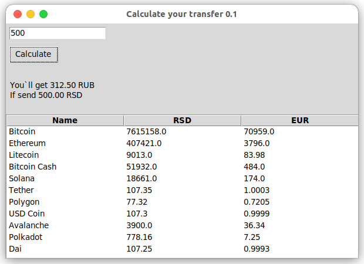
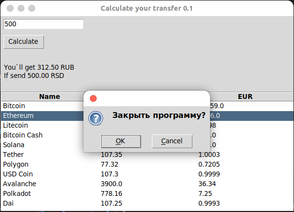

# Transfer Cost Calculator

## Overview

A desktop application for calculating the amount you will receive if you send X amount in Serbian Dinars via cryptocurrency from Serbia to Russia. The calculator receives fresh data using HTML parsing from the websites of the Serbian ECD cryptocurrency service and Google Finance, and takes into account commissions for transfers.

### What does it look like?

### Why was the application created

In Russia, my parents and my wife had an elderly dog named Richa and I needed to send money for his treatment, so as not to count all the commissions and so on, I developed this simple application that always receives up-to-date data. And at the same time, I got acquainted and practiced using the tkinter and beautifulsoup4 libraries for parsing data directly through the HTML code of a third-party service.

### Applied technologies
**Languages**
- Python

**Libraries**
- tkinter
- beautifulsoup4
- requests
- lxml

**Author** Buchelnikov Aleksandr

# Калькулятор стоимости перевода

# Описание

Дестопное приложение для рассчёта суммы, которыю вы получите, если отправите сумму X в Сербских динарах в РФ через криптовалюту. Расчёт производится на основе данных, полученных через парсинг HTML сервисов ECD (Сербский криптокошелек/биржа криптовалюты) и Google Finance. Также учитываются комиссии сервиса ECD.

### Зачем создавалось приложение

В России у наших с женой родителей остался пожилой пес по кличке Рича и мне нужно было отправить деньги на его лечение, чтобы не считать все комиссии и прочее, я разработал это простое приложение, которое всегда получает актуальные данные. И заодно познакомился и потренировался в использовании библиотек tkinter, beautifulsoup4 для парсинга данных прямо через HTML код стороннего сервиса.

### Применяемые технологии
**Языки**
- Python

**Библиотеки**
- tkinter
- beautifulsoup4
- requests
- lxml

**Автор** Бучельников Александр
